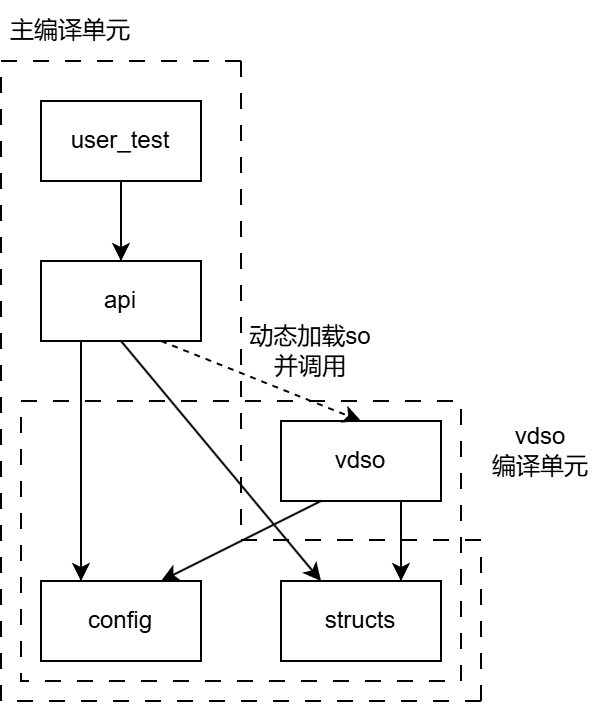

# VDSO_CRATE_TEMPLATE

本项目基于[`AsyncModules/vsched`](https://github.com/AsyncModules/vsched)，一个使用vDSO机制在用户态和内核态间共享的任务调度器。本项目保留了`vsched`中实现和使用vDSO共享库的代码框架，而去除了功能层面（任务调度）的代码，从而使本项目成为一个模板，可以方便地基于此开发不同功能的vDSO共享库，从而更方便地在用户态和内核态间共享代码和数据。

## 项目结构

项目结构如下图所示。

本项目分为两个编译单元。`vdso`及其依赖项会单独编译为一个共享库（`.so`）文件，被加载到内核或用户空间的指定位置。而`api`则与内核或用户的代码（例如`user_test`）一同编译，在获取`so`文件的基地址后，调用`so`文件内的函数。

`config`和`structs`需要两个编译单元共同使用，因此实现为了独立的模块。`config`存储常量形式的配置属性。`structs`则存储会被两个编译单元共同使用的数据结构，包括：1. 在多个地址空间中共享的数据结构，2. 作为`api`的参数和返回值的数据结构。

`vdso`模块是共享库的主模块。用户可在此模块实现vDSO共享库的核心功能，使其被封装为共享库（`.so`）文件，被用户程序和内核进行加载和调用。

`api`模块用于简化“获取加载的vDSO共享库 -> 根据函数名查找函数地址 -> 调用函数”的过程。需要调用vDSO共享库的项目可以直接依赖该模块并调用其中的函数。因此，该模块可以视为整个项目对外的API。该模块中的代码可以根据构建脚本自动生成，并跟随`vdso`的api而动态变化。用户不需修改其中的内容。

`utest`模块是用于测试的用户态代码，实现了加载vDSO共享库、之后调用`api`访问共享库中的函数的功能。其可用于测试共享库功能是否可正常运行。

## 使用说明

如果外部代码需要依赖该库，则需要进行以下几项工作：

1. 在该库的目录下执行`make all`，编译共享库。之后该库的目录下会出现一个`.so`文件。（注意：执行`make`命令时，可能需要根据需求传入一些环境变量，例如`ARCH=riscv64`。查看`Makefile`以确定其接受的环境濒临。）
2. 在外部代码所在的地址空间中映射一块区域，并如此设置：首先保留一块`structs::shared::VvarData`大小的区域，设置为可读可写。在其之后加载第1步中的`.so`文件，并为各个段设置合适的可读/可写/可执行权限。`VvarData`区域与`.so`文件的区域，其基址都需要对齐到`config::PAGES_SIZE_4K`。

   若需要将vdso共享库在不同的地址空间（如用户态与内核态，或者多个用户进程间）中共享，则`VvarData`区域需要实现为共享内存，保证多个地址空间可以访问和操作相同的数据。而`.so`文件的区域则不进行共享，各个地址空间操作一份拷贝。

3. 在外部代码中引入对`api`模块的依赖。在`.so`共享库加载完成后，调用`api::init_vdso_vtable`进行模块初始化。

   （第2、3步骤可以参考`user_test::map::map_vdso`函数的实现）

4. 现在，即可通过`api`模块调用vDSO共享库的各个函数。

## 编译说明

### 编译共享库（包括使用构建脚本更新`api`模块的代码）

`make all`

支持的环境变量：

`ARCH=[x86_64/aarch64/riscv64]`

`MODE=[release/debug]`

需要：对应体系结构的交叉编译工具链

### 编译和运行用户态测试代码

`ARCH=riscv64 make utest`

支持的环境变量：

`ARCH=[x86_64/aarch64/riscv64]`

`MODE=[release/debug]`

`LOG=[error/warn/info/debug]`

需要：对应体系结构的交叉编译工具链、对应体系结构的qemu用户态模拟器

（目前，在我的环境下测试，无论是编译共享库还是用户态测试带你时，ARCH设为x86_64和aarch64均无法通过编译，将ARCH设为riscv64才能正常编译运行。该情况下，需要安装riscv64-linux-musl的编译工具链和qemu-riscv64。）