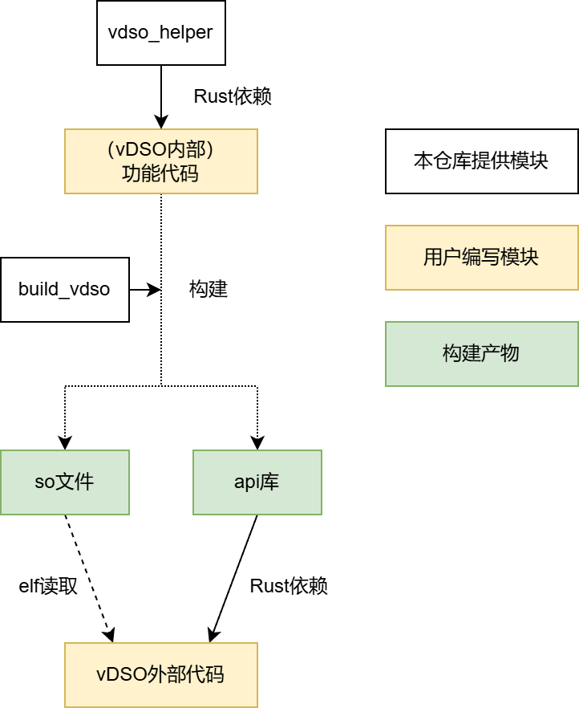

# vDSO共享库构建工具

## 运行测试程序

```shell
make utest
```

可选的环境变量：

- `ARCH`：默认`riscv64`，可选`x86_64`、`aarch64`、`riscv64`
- `LOG`：默认`error`，可选`trace`、`debug`、`info`、`warn`、`error`

目前的编译流程在so文件发生变化时（例如vdso内部代码修改或切换`ARCH`），第一次编译依然引用旧版的so文件，导致可能出现运行错误。在第二次编译时即可正常运行。

## vDSO简介

**vDSO**（Virtual Dynamic Shared Object，虚拟动态共享对象）是 Linux 内核提供的一种机制，用来高效地将某些内核服务暴露给用户空间，而无需进行用户态到内核态的系统调用（syscall）切换。

其原理为：在内核空间中加载一个**二进制共享库文件（`vDSO`）**，以及这个共享库文件访问的**数据区（`vVAR`）**。之后，将`vDSO`和`vVAR`均映射到用户空间，使用户程序可直接访问`vDSO`中提供的接口，并间接访问`vVAR`的数据。通过该方式，即可实现代码和数据在用户态和内核态间、在不同用户程序间的共享。

为何需要单独的`vVAR`数据区，而不是使用`vDSO`中的数据段？

- 在Linux内核的实现中，`vDSO`被整体映射到一个只读区域。因此`vDSO`的数据段只能存储只读数据，而可变数据需要存储在`vVAR`中。
- 在我们扩展`vDSO`功能的实现中，分别加载`vDSO`的代码段和数据段，并赋予相应的读写权限。但有两种可变数据需要区分：(1)共享的可变数据，在一个地址空间中的修改可以反映到其它地址空间中；(2)私有的可变数据，每个地址空间持有不同的拷贝，修改互不影响。因此我们使用`vVAR`存储共享的可变数据，而使用`vDSO`中的数据段存储私有的可变数据。

关于vDSO的更详细介绍参考[RISC-V Syscall 系列 4：vDSO 实现原理分析](https://tinylab.org/riscv-syscall-part4-vdso-implementation/)。

## 本项目内容

前文已提及，vDSO技术可用于用户和内核之间、用户进程之间的代码与数据共享。其可应用于一些需要如上的代码数据共享的领域，例如共享任务调度、异步系统调用和进程间通信。本项目即使用vDSO机制实现上述的功能。

本仓库中的两个crate，`vdso_helper`和`build_vdso`，用于支持使用Rust语言方便地开发和构建`vDSO`共享库：

- `vdso_helper`：封装了`vDSO`代码所需的操作，包括(1)访问`vVAR`数据和(2)定义可由环境变量修改的常量。
- `build_vdso`：将`vDSO`代码的构建流程整合到`vDSO`外部代码的构建流程中，并构建可被`vDSO`外部代码依赖的API库。

通过它们实现的，`vDSO`开发和构建流程如图所示：



基于本项目开展了如下的工作：

- [`vsched`](https://github.com/rosy233333/vipc)：基于vDSO机制的调度器，后续将开发为用户态、内核态的统一调度器。
- [`vqueue`](https://github.com/rosy233333/vqueue)：基于vDSO机制的IPC队列，由[`vipc`](https://github.com/rosy233333/vipc)使用。

目前本项目的工作在[AsyncOS](https://github.com/rosy233333/async-os/tree/vdso-test)上运行，未适配Linux。

## vDSO共享库开发和使用流程

### 开发`vDSO`库

1. 创建`no_std`、`lib`类型的Rust crate，并创建一个模块`api`和源文件`api.rs`。
2. 依赖`vdso_helper`，使用其中的`vvar_data!`和`get_vvar_data!`定义和访问共享数据。
3. 通过声明静态变量的方式声明私有数据。
4. （可选）通过`vdso_helper`中的`mut_cfg!`和`use_mut_cfg!`定义在编译期由环境变量指定的常量。
5. 将暴露出的接口函数放置在`api.rs`中，且使用以下的函数定义：

```Rust
#[unsafe(no_mangle)]
pub extern "C" fn 函数名(参数) -> 返回值 {
    函数体
}
```

注意：不是所有对外提供的函数都需要放入`api.rs`（例如对外提供某些类型关联的方法）。但是，如果该对外提供函数（直接或间接地）访问了共享数据，则必须放入`api.rs`中。

### 构建和使用`vDSO`库

1. 在`vDSO`外部代码的`build.rs`中使用`build_vdso`，配置`BuildConfig`构建参数，并传入`build_vdso`函数以构建`vDSO`库。
2. 执行一次构建后，可在输出目录中找到so文件与API库。
3. 加载`vDSO`和`vVAR`：在外部代码所在的地址空间中映射一块区域，并如此设置：首先保留一块`VvarData`大小的区域，设置为可读可写。在其之后的下一页加载第2步中的so文件，并为各个段设置合适的可读/可写/可执行权限。`vVAR`区域与`vDSO`区域的基址都需要对齐到`config::PAGES_SIZE_4K`。
4. 依赖API库，并传入`vDSO`的加载基址。
5. 通过API库，调用`vDSO`的API。
6. 创建用户进程时，将`vDSO`和`vVAR`映射到其地址空间，并向用户进程传递`vDSO`的基址。用户进程即可通过第4、5步的方式使用vDSO。

## vDSO接口的说明与限制


外部代码通过api库访问vDSO功能代码，而从vDSO功能代码到api库有两条路径：

1. vDSO功能代码编译为so文件，被外部代码加载后，由api库从so文件中定位函数入口并进行函数调用。 **需要访问共享数据的接口** 都需要使用此路径。在`api.rs`中声明的接口函数使用了该路径。
2. api库直接通过Rust依赖导入vDSO功能代码中的所有公开项，并提供给外部代码。只有 **不需访问共享数据的接口** 才可使用该路径。在vDSo共享库除了`api.rs`之外的其它位置中声明的接口使用了该路径。

从路径1提供的接口存在如下限制：

1. 接口只能为函数，而不能为类型或与类型关联的方法。
2. 接口中不能包含泛型，也因此不能包含以`async`声明的函数，因为它实际上是返回`impl Future`的泛型函数的语法糖。
3. 无法使用外部的堆分配器，也就是说，不能在vDSO共享库中使用`alloc` crate中提供的类型或方法。因为其需要被单独编译为so文件，所以无法从它的调用者中获得堆分配器。

从路径2提供的接口与路径1相比，可以提供类型和方法，可以包含泛型。但仍存在如下限制：

1. 无法使用外部的堆分配器，原因与路径1的相同。
2. 无法访问共享数据。因为从路径2中调用的函数实际并未进入加载的so文件，因此也无法获取到正确的共享数据地址。即使是间接访问共享数据也不行：如果一个接口本身未访问共享数据，但它调用的函数访问了共享数据，则其同样无法使用路径2.
3. 路径2与路径1的私有数据是两份不同的拷贝。如果某个私有数据会被路径1的接口访问（可能因为该接口需要访问共享数据），则为了使对私有数据的修改对上述接口可见，需要把所有操作该私有数据的接口均放在路径1中。

## 使vDSO依赖外部代码

在vDSO的`interface.rs`中使用`trait_interface`宏定义一个`trait`，可以使外部代码实现这些`trait`，而让vDSO调用外部代码的实现。

其实现原理为：vDSO会为这个`trait`在私有数据区创建一个虚函数表（放在私有数据区而非共享数据区，是为了考虑实现代码在不同的地址空间中被映射到了不同位置的情况），并在进程内初始化时初始化虚函数表。之后，就可通过虚函数表调用`trait`的函数。同时，外部代码可以以指针形式传递实现了这个`trait`的结构体类型，vDSO内部获得指针后，会将其转化为一个“虚拟实现”类型的引用，从而同样通过虚函数表调用`trait`的函数。

该机制可以使vDSO实现两种功能：

1. 如果`trait`中定义的方法都不包含`self`的引用，则这样的依赖接口类似于`crate_interface`库提供的功能，使上游（vDSO内部）可以依赖下游（vDSO外部）的函数。
2. 如果`trait`中定义的方法包含`self`的引用，则其在某种程度上为vDSO提供了处理泛型的功能，使一些在vDSO内部操作的类型可以在vDSO外部定义与实现，也增加了vDSO的可移植性（例如，一个基于vDSO的任务调度器就可以兼容不同系统中定义的任务类型）。不过，这样的泛型支持也是有限制的：每个地址空间中只能提供一种实现。

## 改进方向

1. [ ] 在内核态按需加载vDSO（在加载用户程序时按照是否调用相应接口，加载vDSO的相应模块；或者在用户程序调用接口时加载）
2. [x] 目前用户态和内核态需要各自独立加载一遍编译产生的中间库，但这个中间库内部又会包含原始库、包含so文件，相当于和两边各自链接一遍库一样，并没有发挥vdso节省空间的优势。可能可以通过在用户态和内核态加载不同feature的版本解决？
3. [ ] 用户态和内核态的加载过程还是存在区别（例如，AsyncOS从地址空间中寻找空闲区的过程只对用户态有效，内核态的空闲空间被分配器管理，从地址空间的视角已占用，内核地址空间不存在空闲区。），需要修改加载的实现
4. [ ] 内存映射需要增加区分内存页是否共享的标签。
5. [ ] MemIf需要在每个空间中都实现一遍，但实际上没有必要，应该只在内核空间中实现就行。
