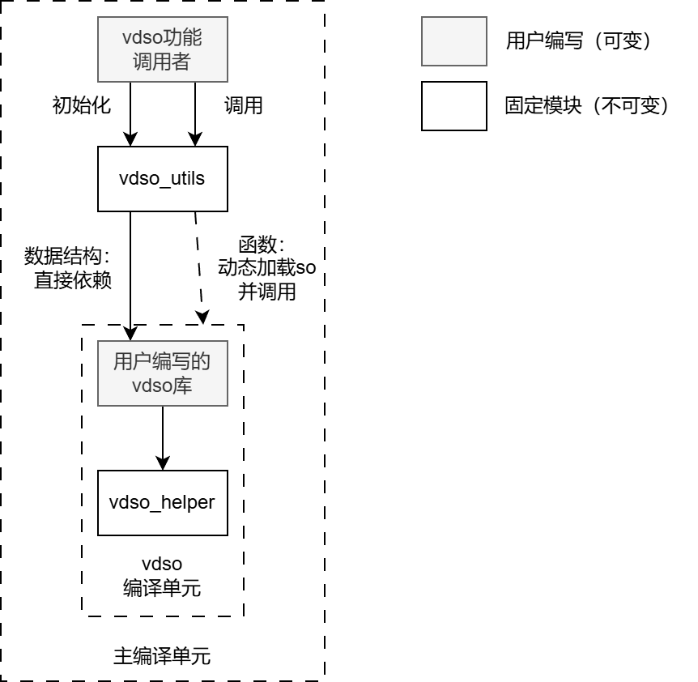

# 重新设计的模块结构

为了提高模块化结构，重新设计了项目的模块结构，主要目的是**将可变的模块和不可变的模块区分开来**，使得不同的vdso库均可复用其中的不可变模块。



本项目希望提供以下两个不可变模块：

**vdso_utils**：生成调用者调用vdso所需的函数和数据结构，包括：

- 在自身的编译流程中编译vdso编译单元
  - 实现方式：提供在build.rs中调用的函数，其输入vdso共享库的路径，将vdso共享库编译为so文件并复制到项目目录内。
- 提供vdso和vvar区域的大小及内容，用于初始化vdso/vvar区域。（这些区域的分配和共享仍需由调用者实现。）
  - 实现方式：vdso区域的大小及内容通过读取前文提到的so文件获得。vvar区域的大小和内容通过获得vdso_helper生成的`VvarData`类型实现。
- （在已将vdso/vvar加载到内存的前提下）实现对vdso中函数的调用。
  - 实现方式：提供宏`gen_api`，输入vdso共享库的名称和加载地址，自动生成“创建和维护vtable、根据vtable调用vdso中函数”的api。这样的api可以被模块其它位置直接调用。

**vdso_helper**：用于使vdso库使用一些vdso的特定功能，包括：

- 为vdso库提供声明和使用共享全局变量的方式。（如果用一般方式声明全局变量，则为私有全局变量。）
  - 实现方式：提供宏`vvar_data`，用于声明共享全局变量。该宏输入各种成员字段，该宏会生成一个包含这些字段的`VvarData`类型。(1)再提供宏`get_vvar_data()`，输入共享变量名，通过先获取vvar区域首地址，再加上变量在`VvarData`中的偏移的方式，获得该变量的引用。
- 为vdso_utils提供共享全局变量的大小和初始化。
  - 通过`VvarData`类型实现。`VvarData`类型提供用于初始化的`new`方法。

Rust的宏分为简单的声明宏和复杂的过程宏两类。如上所需的所有宏应该只需要声明宏才能实现。

(1)：该宏类似下面的效果：

```Rust
vvar_data! {
    VAR1: Type1,
    VAR2: Type2,
} // 其中涉及的类型需要实现Default和Sync。

=>

#[derive(Default)]
pub struct VvarData {
    VAR1: Type1,
    VAR2: Type2,
}
```