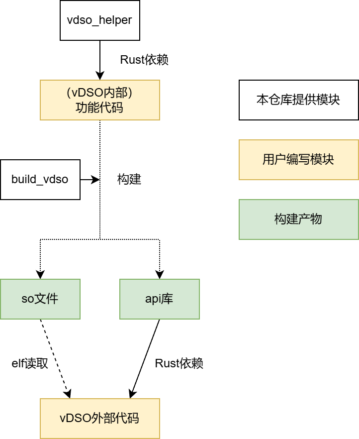

# 重新设计的模块结构

为了提高模块化结构，重新设计了项目的模块结构，主要目的是**将可变的模块和不可变的模块区分开来**，使得不同的vdso库均可复用其中的不可变模块。

## 编写

vdso库的编写与编写一般的库的操作类似，因此，可以很方便地把一般库改造为vdso库。

vdso库的静态变量分为共享数据和私有数据两类。前者会在不同的地址空间中共享，后者只在该地址空间中使用，不同地址空间持有不同的拷贝。使用`vdso_helper`库中的`vvar_data!`宏声明的全局变量即为共享数据，可使用`get_vvar_data!`宏获取其引用。普通的全局变量即为私有数据。

此外，vdso库对外提供的API有一定要求：

1. 所有的API均放置在本模块的`api`子模块中。
2. 目前，API仅支持函数形式。并且函数需要声明为`#[unsafe(no_mangle)]`和`pub extern "C"`。
   
     出于此限制，在API函数中无法使用泛型和异步。

3. 函数的参数和返回值用到的自定义数据结构，均需要声明为`pub`和`#[repr(C)]`（例如此处的`ArgumentExample`）。
4. 该库导出的所有函数和数据结构均需要导出在根模块中。
   
     （例如，导出子模块中的`pub`符号时，需要使用`pub use submod::*;`，而非`pub use submod;`）

## 构建

使用`build_vdso`库提供的函数`build_vdso`，可以将上述vdso库构建为so文件与api库。该函数可以被整合到vdso调用者的`build.rs`构建脚本中。

so文件即为vdso库编译成的动态库二进制文件。

api库中包含以下内容：

- 从vdso库中导出的数据结构（例如，用于API参数和返回值的数据结构）
- 用于在调用vdso库的API前，根据so文件的加载位置初始化VTable的初始化函数`init_vdso_vtable`
- 通过VTabel调用so文件中的API的函数（与vdso库中的API函数同名）

## 使用

vdso的调用者通过so文件和api库使用vdso。

**初始化**：调用者在内核空间中准备好用于vvar和vdso的内存页。vvar内存页通过api库提供的`VvarData::default`函数初始化；在vdso内存页中加载so文件。最后，调用`init_vdso_vtable`函数初始化VTable。

**映射到用户空间**：内核态调用者将vvar和vdso内存页映射到用户空间，并向用户空间传递vdso的首地址。用户态调用者也需要执行一次`init_vdso_vtable`函数。

**使用**：无论在内核态还是用户态，都可以通过api库提供的同名API函数使用vdso库的功能。
